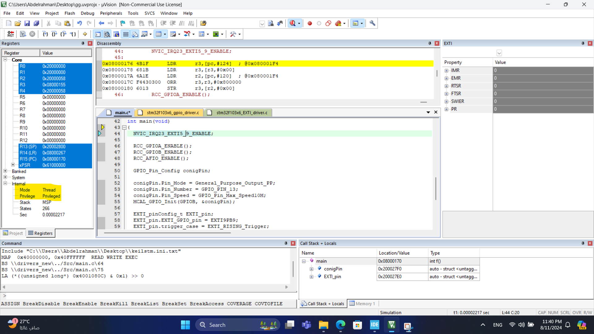
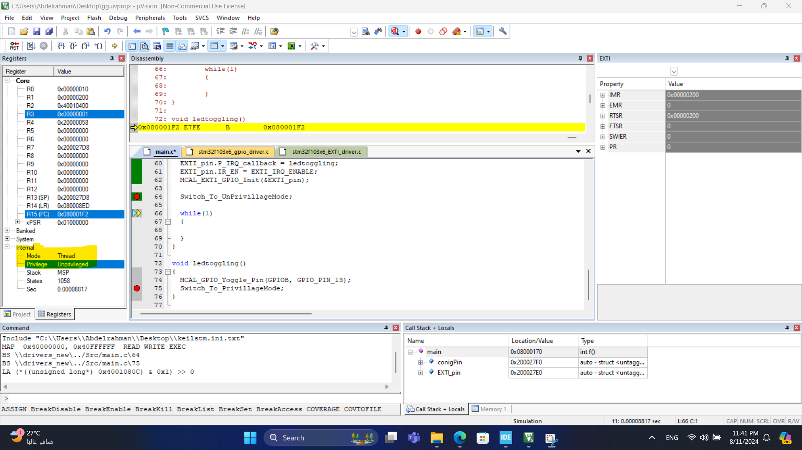
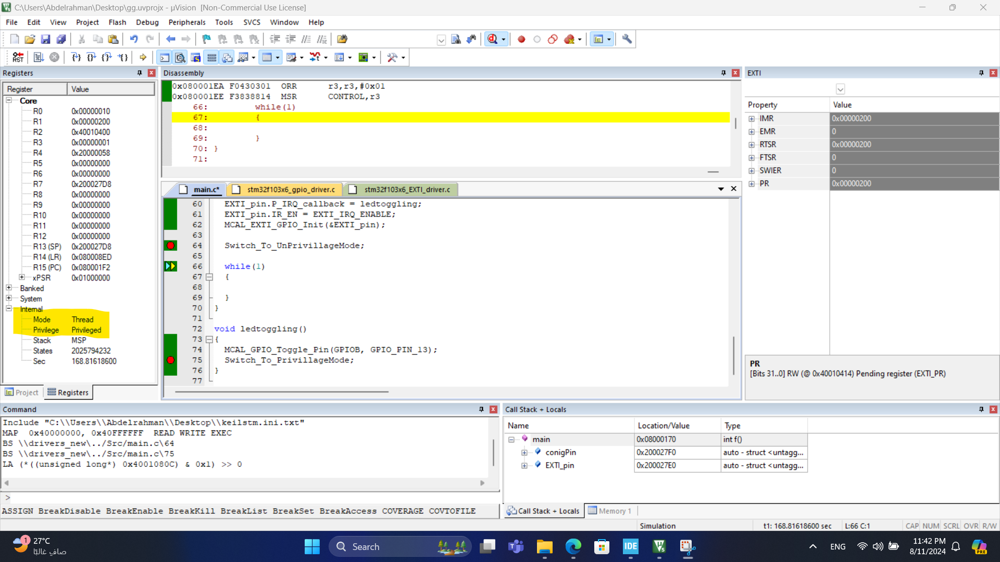

# LAB topic
the lab is about switching form privileged to unprivileged mode and vice versa

# LAB simulation in keil
- before switching to unprivileged mode 

- after switching to unprivileged mode 

- switching back to privileged mode in ISR
