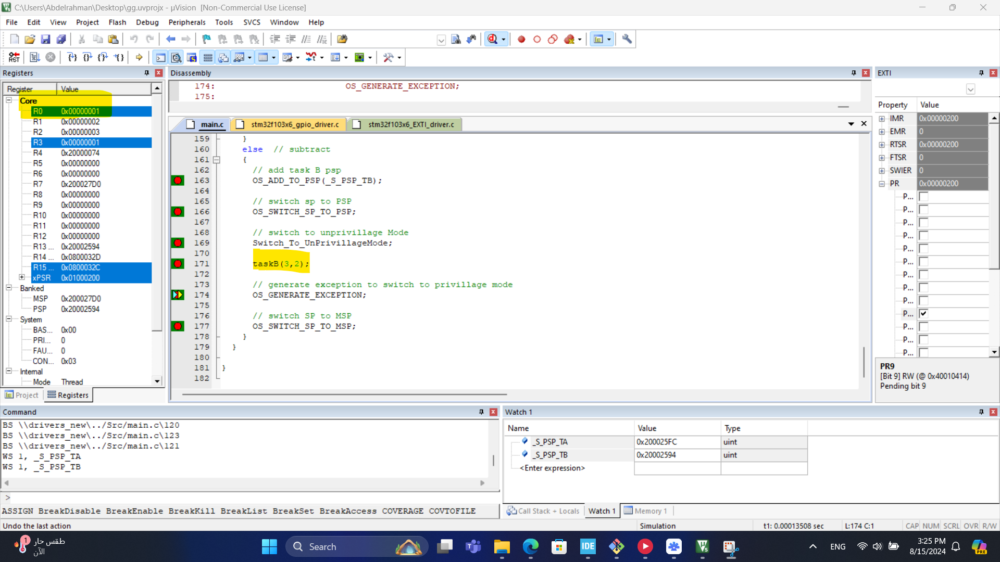

# LAB topic
the lab is about simulating an OS schedular that switches between taskA and taskB

# LAB simulation in keil
- system start with taskA until an interrupt occur to switch to taskB
- first we store stack of taskA in PSP

- switch the sp to PSP

- switch to unprivileged mode

- run taskA and get it's return in R0=5 (3 + 2)

- calling SVC instruction to switch to privillage mode in the SVC handler

- switching sp from PSP to MSP

- when EXTI occurs on PB9 we switch to taskB 

- first we store stack of taskB in PSP

- switch the sp to PSP

- switch to unprivileged mode

- run taskB and get it's return in R0=1 (3 - 2)

- calling SVC instruction to switch to privillage mode in the SVC handler

- switching sp from PSP to MSP

