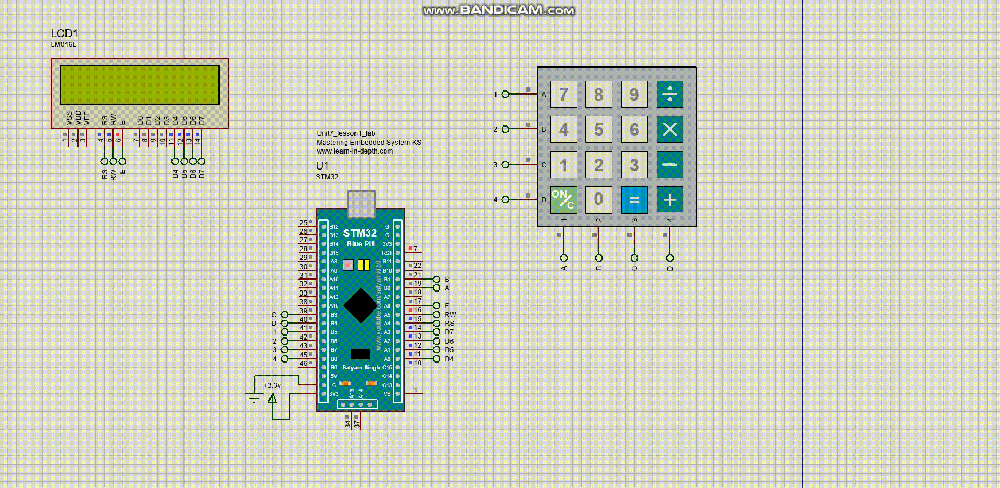

# LCD Data writing using Keypad with STM32 bluepill

This project demonstrates how to write data on an LCD (Liquid Crystal Display) using Keypad.

## Setup Instructions

1. Connect the bluepill microcontroller to the LCD display as in the circuit diagram.
2. Flash the provided firmware onto the bluepill microcontroller.

## How to Use

1. Power on the simulation in proteus.
2. The LCD will display the data written by Keypad.

## Circuit Diagram

