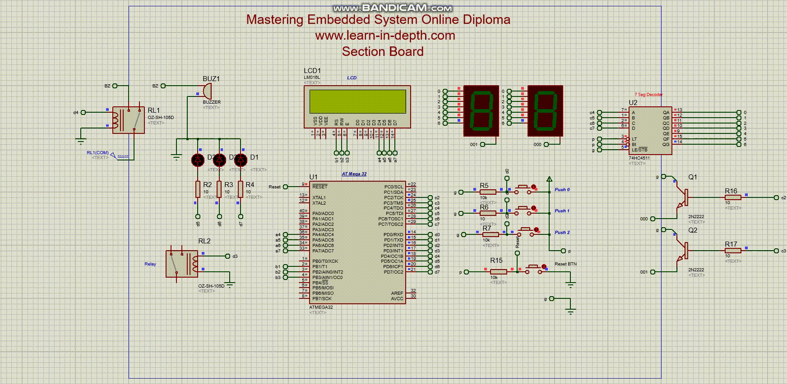

# LCD Data display with ATmega32

This project demonstrates how to display data on an LCD (Liquid Crystal Display).

## Setup Instructions

1. Connect the ATmega32 microcontroller to the LCD display as per the circuit diagram.
2. Flash the provided firmware onto the ATmega32 microcontroller.

## How to Use

1. Power on the simulation of Amit kit in proteus.
2. The LCD will display the data.

## Circuit Diagram

